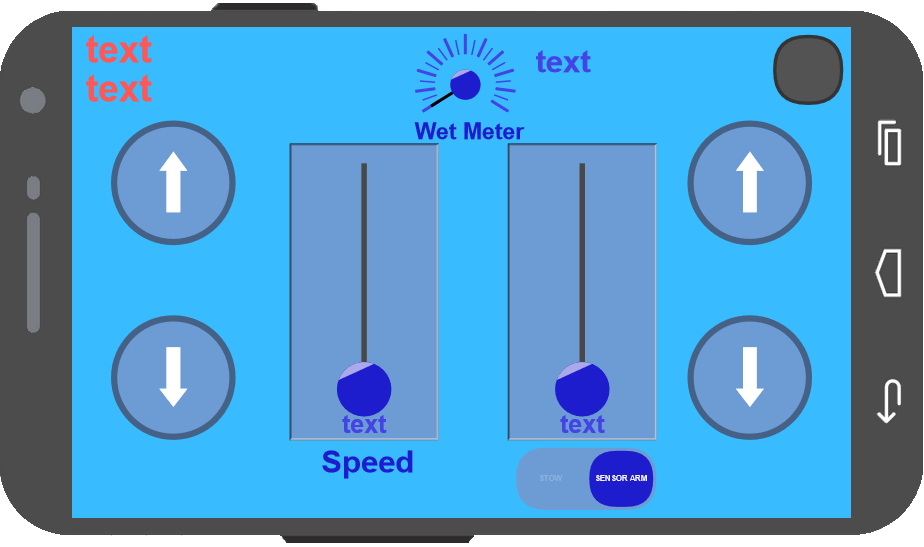

    

# Soil Rover Student Project

### Class
EGEN 310R-020 
Fall Semester 2021

### Contributors
- Code/Electronics
  - [Joseph Burke](https://github.com/josephbur/) (CS)
- Chassis/Mechanics
  - Kenton Sugden (MET)
- Other Group Members (Non-Rover Responsibilities)
  - Graham Prior (CE)
  - Sandra Kohl (EENV)
  - Giray Elmali (BE)

### Built Using

- Software
  - [PlatformIO](https://platformio.org/)
  - [RemoteXY](https://remotexy.com/)
- Hardware
  - [Arduino Uno R3](https://docs.arduino.cc/hardware/uno-rev3)
  - [Adafruit Motor Shield V2](https://learn.adafruit.com/adafruit-motor-shield-v2-for-arduino)
  - [Adafruit STEMMA Soil Sensor](https://learn.adafruit.com/adafruit-stemma-soil-sensor-i2c-capacitive-moisture-sensor)
  - [Adafruit TT Motors 1:90 Gear Ratio](https://www.adafruit.com/product/3802)
  - [HC-05 Bluetooth Module](https://components101.com/wireless/hc-05-bluetooth-module)
  - [TiankongRC MG995 180 degree Servo](https://components101.com/motors/mg995-servo-motor)
  - [2x 18650 Batteries](https://www.batteryjunction.com/18650.html)

### Images

     
    

